# 七牛云存储常见问题

## 一、概念篇

1. [七牛云存储是什么？有什么用处？](#qiniu-cloud-storage)
2. [七牛云存储能为我解决什么问题？](#problems-qiniu-cloud-storage-solved)
3. [七牛云存储和其他云存储相比有什么优势？](#superiority)
4. [七牛云存储如何保证数据安全性？](#security-guarantee)

## 二、计费篇

1. [七牛云存储如何收费？价格怎样？](#price)
2. [是否提供试用，如何申请试用，试用周期多长？](#try)
3. [如何查询账单？](#bill)
4. [如何获取发票？](#invoice)

## 三、使用篇

### [文件上传](#upload-file)

1. [七牛云存储可以存储哪些数据？](#data-stores-in-qiniu)
2. [是否限制单个文件大小？](#file-size)
3. [如何上传文件到七牛云存储？](#how-to-upload)

### [AccessKey/SecretKey](#key)

1. [什么是密钥（AccessKey/SecretKey）？密钥的作用是什么？](#accesskey-secretkey)
3. [如何获取和保护密钥？](#accesskey-secretkey-security)

### [Bucket](#bucket)

1. [什么是空间（Bucket）？有何作用？](#bucket-usefulness)
2. [如何创建空间？](#create-bucket)
3. [我可以创建多少个空间？](#bucket-number-limitation)
4. [每个空间提供多大配额？](#bucket-capacity-limitation)
5. [我应该如何使用空间？](#use-bucket)
6. [如何删除空间？](#delete-bucket)

### [文件外链](#file-link)

1. [如何为空间绑定域名，为文件提供URL链接访问？](#publish-with-custom-domain)
2. [如何自定义处理 404 Not Found ？](#404-not-found)
3. [如何解除域名绑定，取消文件URL链接访问？](#unpublish)

### [防盗链](#antileech)

1. [什么是 “防盗链” ？](#what-is-antileech)
2. [什么是 “refer 防盗链” ？](#what-is-refer-antileech)
3. [如何设置 “防盗链”　？](#how-to-antileech)
4. [什么是白名单 / 黑名单？](#white-list-black-list)
5. [如何设置白名单或黑名单？](#white-list-black-list-setting)
6. [如何取消 “防盗链” ？](#cancel-antileech)

### [镜像存储](#mirror-storage)

1. [什么是镜像存储？有什么作用？](#what-is-mirror-storage)
2. [如何使用镜像存储？](#how-to-mirror-storage)
3. [如何取消镜像存储使用？](#cancel-mirror-storage)

### [发布静态网站](#publish-static-website)

1. [什么是静态网站？](#static-website)
2. [如何用七牛云存储发布和更新静态网站？](#use-qiniu-cloud-storage-publish-static-website)
3. [七牛云存储针对静态资源资源访问是否提供 GZip 压缩输出加速访问？](#gzip-your-website-static-resources)
4. [如何为静态网站自定义 404 Not Found 页面？](#static-website-404-notfound)
5. [如何取消静态网站访问？](#cancel-static-website)

### [图像处理](#image-process)

1. [七牛云存储是否提供自定义缩略图处理？如何提供使用？](#custom-thumbnail)
2. [如何自定义缩略图规格？](#thumbinal-style)
3. [如何自定义友好URL风格？](#friendly-style)
4. [是否提供打水印的功能？](#watermark)
5. [如何设置原图保护？](#origin-image-protection)

### [视频/音频处理](#video-audio)

1. [七牛云存储是否支持为上传的视频/音频源文件提供压缩转码处理？](#video-audio-compress-transcoding)
2. [如何使用七牛云存储的视频/音频处理服务？](#qiniu-cloud-storage-video-audio-service)

## 四、工具篇

1. [如何使用命令行工具同步文件到七牛云存储？](#sync-file-to-qiniu-cloud-storage)
2. [有无提供命令行工具辅助开发调试？](#command-line-debug-helper-tools)

## 五、开发篇

1. [七牛云存储服务集群如何架构？](#qiniu-architecture)
2. [Web 网页如何向七牛云存储直传文件？](#upload-file-to-qiniu-from-web)
3. [iOS / Android 移动端如何向七牛云存储直传文件？](#upload-file-to-qiniu-from-iOS-Android)
4. [PC / 服务端程序如何向七牛云存储直传文件？](#upload-file-to-qiniu-from-PC-Server)

## 一、概念篇  

#### 1. 七牛云存储是什么？有什么用处？

七牛云存储是一个专注于为企业提供优秀的云存储服务的公司。七牛云存储的使命是为企业提供安全、可靠、方便且快速的数据存储服务。开发者使用七牛云存储提供的API，即可存储和管理海量非结构化数据（文件），而无需自己管理额外的存储服务器，也无需关心底层细节的变化。

#### 2. 七牛云存储能为我解决什么问题？

* 节省成本：

七牛云存储为客户提供按需付费的方式，客户使用了多少空间和流量，就为这些空间和流量付费。并且，七牛云存储提供的存储空间和流量是无限制的。因此，使用七牛的云存储服务，开发者用户不仅无需维护自己的存储服务器，更无需按照峰值流量和存储空间来配置服务器的带宽，即可获得超过自身流量和存储空间峰值的存储服务器，但只需为实际使用量付费。

* 海量存储：

在数据越来越多的时代，海量存储是多数开发者无法回避的问题之一。七牛云存储能够为开发者提供海量的数据存储服务。

* 专注：

虽然每个开发者都能够通过一定的积累掌握海量存储的技术，但并不是每个开发者都要重复造轮子。把存储服务交给专业的公司做，让自己专注于业务开发，专注于为用户提供最好的业务服务。

* 加速：

通过优化用户数据的上传和下载方式，以及与国内和国外优秀的CDN加速服务提供商合作，七牛云存储服务能够让您的用户快速访问您存储在七牛服务器上的资源。

#### 3. 七牛云存储和其他云存储相比有什么优势？

* 全球服务架构

独特的架构可向全世界提供可靠、快速和保证数据一致性的存储服务。要查看更多细节，[请点击这里](#http://qiniutek.com/product/global/)。

* 多数据副本

多份副本存储到位于不同数据中心的不同服务器上，最大程度保障数据安全。
要了解更多关于七牛云存储如何保护您的数据安全的细节，[请查看这里](#http://qiniutek.com/product/security/)查看我们的安全白皮书。

* 双向传输加速
分布各地的加速节点，自动选择离用户最近的节点，保证数据上传下载的速度。

* 按需付费

我们的服务是按需付费的。因此您不用再去花费大量的时间做预算，仅仅为了确定到底需要购买多少服务器和带宽。而且您也不再需要去操心购买过来的带宽和服务器的闲置或者紧缺问题。这些都有七牛来负责帮您解决。
要了解更多关于七牛云存储如何为您节省费用的细节，请点击这里查看我们的[成本优势](#http://qiniutek.com/product/cost/)。

* 结构灵活

可自由选择分布式键/值对方式的平面结构或文件系统树状结构的存储结构。

* 断点续传

不仅支持数据下载的断点续传，还支持数据上传的断点续传，保障客户体验。

* 图片与视频处理

内置图片缩略图快速生成和EXIF信息提取等功能，让图片管理更容易，不用再单独进行相关的开发。更重要的是，因为这些内置的功能，您可以更加节省您的服务器和带宽成本。

#### 4. 七牛云存储如何保证数据安全性？

用户上传的文件至少存放于3台不同的服务器，并置于不同机房，使得数据安全毫无隐患。独特的存储自备份机制，在任何一台发生服务器故障时，都会在另一台服务器上自我修复一份新数据。

详细的数据安全策略请参考：[http://qiniutek.com/product/security/](http://qiniutek.com/product/security/)

## 二、计费篇

#### 1. 七牛云存储如何收费？价格怎样？
	
空间和流量按需收费。

#### 2. 是否提供试用，如何申请试用，试用周期多长？
	
提供试用，试用时间长达3个月，试用期间免费。

#### 3. 如何查询账单？
	
登入七牛云存储开发者中心，可查看[交易记录](#https://dev.qiniutek.com/account/recharge)以及[用户使用报表](#https://dev.qiniutek.com/report)

#### 4. 如何获取发票？

如需开具发票，请[联系我们的工作人员](#http://qiniutek.com/about/contact/)。
	

## 三、使用篇

### 文件上传

#### 1. 七牛云存储可以存储哪些数据？

七牛云存储主要存储以文件形式存在的非结构化数据，如视频和音频文件、图片、PDF和Word文档等。

#### 2. 是否限制单个文件大小？

不限制。

#### 3. 如何上传文件到七牛云存储？

您可以调用七牛云存储提供的API在服务端将文件上传到七牛云存储服务器，也可以让您的用户直接将数据上传到七牛的服务器而无需经过您的业务服务器。

### AccessKey/SecretKey

#### 1. 什么是密钥（AccessKey/SecretKey）？密钥的作用是什么？
	
密钥是一个`ACCESS_KEY/SECRET_KEY`对，`ACCESS_KEY`用于标识客户方的身份，在网络请求中会以某种形式进行传输，`SECRET_KEY`作为私钥形式存放于客户方本地并不在网络中传递，`SECRET_KEY`的作用是对于客户方发起的具体请求进行数字签名，用以保证该请求是来自指定的客户方并且请求本身是合法有效的。使用`ACCESS_KEY`进行身份识别，加上`SECRET_KEY`进行数字签名，即可完成应用接入与认证授权。

	
#### 2. 如何获取和保护密钥？

您可以通过如下步骤获得`ACCESS_KEY`和`SECRET_KEY`：

* [开通七牛开发者帐号](#https://dev.qiniutek.com/signup)

* [登录七牛开发者自助平台，查看ACCESS_KEY和SECRET_KEY](#https://dev.qiniutek.com/account/keys)

有了密钥之后，您就可以顺利的接入云存储，因此，从账户的安全性考虑，请妥善保管密钥，不要将其泄漏给他人。同时，为了保护账户的安全性，七牛云存储为您提供了"主/从"密钥的机制：一个帐号最多拥有两对Access/Secret Key，第1对为主密钥，第2对为从密钥。主密钥不能直接删除，从密钥可以；从密钥删除后，可以新增一对主密钥，原旧的主密钥降格为从密钥。出于安全考虑，建议您周期性地删除从密钥并创建使用新的密钥。

### Bucket

#### 1. 什么是空间（Bucket）？有何作用？

空间（Bucket）是一个文件存储的集合，在七牛的云存储服务器上映射为一个包含多个资源的表名，其中每个资源为用户上传的文件。空间（Bucket）的作用在于让您根据业务需求独立管理数据。
	

#### 2. 如何创建空间？

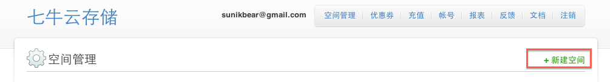
	
如上图所示，您可以在七牛开发者中心的后台[手动创建空间](＃https://dev.qiniutek.com/buckets/new)，也可以通过七牛云存储提供的API来[创建空间](#http://docs.qiniutek.com/v3/api/io/#mkbucket)。

#### 3. 我可以创建多少个空间？

您可以创建无限多个空间。

#### 4. 每个空间提供多大配额？
	
每个空间提供的存储容量配额和流量配额不限，但是只收取已使用资源的费用。

#### 5. 我应该如何使用空间？

空间创建好后，您可以根据[七牛云存储提供的API](#http://docs.qiniutek.com/v3/api/io/)来使用空间。

#### 6. 如何删除空间？

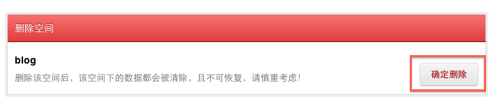
	
如上图所示，您可以在七牛开发者中心的后台[手动删除空间](＃https://dev.qiniutek.com/buckets/)，也可以通过七牛云存储提供的API来[删除空间](#http://docs.qiniutek.com/v3/api/io/#drop)。

### 文件外链

#### 1. 如何为空间绑定域名，为文件提供URL链接访问？

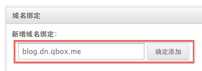
	
如上图所示，如果您创建的空间名为 "blog" ，缺省情况下，您可以绑定一个七牛云存储提供的子域名 "blog.dn.qbox.me"。如果该子域名被别的用户占用，也可以为该空间绑定另一个子域名，如 "blog2.dn.qbox.me"。
	
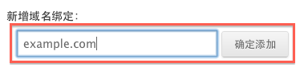
	
您也可以为空间绑定自定义域名如 "example.com"，只需在 "example.com" 这个域名的 DNS 管理平台添加一条指向 "iovip.qbox.me" 的 CNAME 记录。使用自定义域名，需要您将此域名备案号和企业营业执照信息发送到 support@qiniutek.com 进行备案。
	
一个bucket可以绑定多个域名，只要所绑定的域名不相互冲突。域名绑定完之后，您就可以以公开外链的形式访问该域名下的资源。

#### 2. 如何自定义处理 404 Not Found ？

当您[绑定域名创建公开外链](#http://docs.qiniutek.com/v3/api/io/#publish)后，若公开的外链找不到该文件，即可使用您上传的“自定义404文件”，以应对HTTP 404出错的情况。
	
为此，您只须在名为 action 的表单域中将 EncodedEntryURI 元素中的 `<Key>` 设置为固定字符串类型的值 `errno-404` 即可

#### 3. 如何解除域名绑定，取消文件URL链接访问？

如果您不希望公开发布资源，或者换用别的域名，可以删除当前绑定的域名，如下图所示。
	
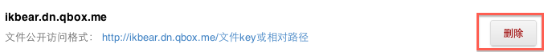

### 防盗链

#### 1. 什么是 “防盗链” ？
	
盗链是指某个网站引用了不是保存在自身服务器上的资源。举个简单的例子，您将图片存储在七牛云存储服务器，通过公开发布图片的外链后，任何人都可以访问该资源。但是，七牛云存储服务器上存储的资源是按照存储空间和访问量来收费的，因此您可能不希望存储在七牛云存储服务器上的资源被部分用户访问到，比如迅雷。为此，您可以为已公开发布的资源启用“防盗链”的功能。

#### 2. 什么是 “referer 防盗链” ？

进行防盗链的常用方法是，在服务器端检测访问某资源的来源。在HTTP协议中，有一个名为referer的Header字段，它保存的是链接到当前文件或者网页的URL地址，服务器端通过判断该地址的合法性来判断是否为该访问提供服务。

#### 3. 如何设置 “防盗链”　？

要开启“防盗链”功能，您可以在七牛云存储开发者中心的[“空间管理”](#https://dev.qiniutek.com/buckets)中设置“黑名单”与“白名单”，如下图所示。
	
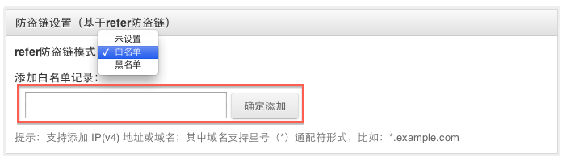

#### 4. 什么是白名单 / 黑名单？

设置了“白名单”之后，如果客户端发起的HTTP请求中其头部的referer字段中的URL地址能够匹配“白名单”中的某些地址，则七牛云存储服务器端允许该客户端访问该资源。
	
设置了“黑名单”之后，如果客户端发起的HTTP请求中其头部的referer字段中的URL地址能够匹配“黑名单”中的某些地址，则七牛云存储服务器端拒绝该客户端访问该资源。

需注意的是，“白名单”与“黑名单”不可同时设置，您要么设置“白名单”，要么设置“黑名单”。
	

#### 5. 如何设置白名单或黑名单？
	
白名单或者黑名单的值为 IPv4 地址或域名，其中域名支持星号（*）通配符，如`*.example.com`。设置了“黑名单”之后，禁止访问该资源的网站列表会出现在黑名单列表中，如下图所示。
	
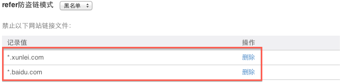
	
设置了“白名单”之后，允许访问该资源的网站也会出现在白名单列表中，如下图所示。
	
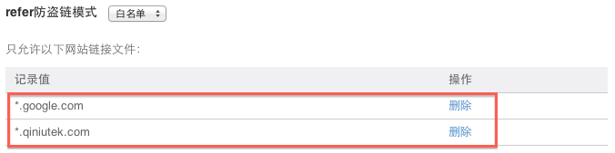

#### 6. 如何取消 “防盗链” ？

要取消“防盗链”，只需将referer防盗链模式设置为“未设置”即可，如下图所示。
	
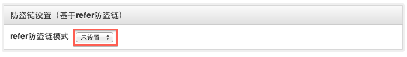

### 镜像存储 

#### 1. 什么是镜像存储？有什么作用？
	
镜像存储是指将您的网站资源自动同步到七牛云存储，使用七牛云存储来托管。 您可以使用已绑定的域名访问镜像存储的源站资源。格式为： http://绑定域名/源站资源相对路径。这样，您的用户初次访问某个资源时，他首先访问七牛云存储服务器，如果七牛云存储服务器上没有该资源，则七牛云存储服务器会自动去您设置的源站获取该资源，并将其存储在七牛云存储的服务器上。下次您的客户再次访问该资源时，就可以直接从七牛云存储服务器上获取。
	
从上面我们看到，用户初次访问某个资源时，该资源可能不在七牛云存储的服务器上，可能需要去您设置的源站取回资源，在这里七牛云存储服务器起的是一个“代理”的作用，还可能将返回资源的速度减慢。那么镜像存储有什么作用呢？事实上，速度减慢只在用户初次访问时发生。等资源存储在七牛云存储服务器后，您不仅不需要关注底层的存储细节，还可以获得七牛云存储内置的CDN加速功能，让您的用户更快速的访问网站。
	

#### 2. 如何使用镜像存储？
	
要使用镜像存储功能，您可以在七牛云存储开发者中心的[“空间管理”](#https://dev.qiniutek.com/buckets)中设置“一键加速网站”。
	
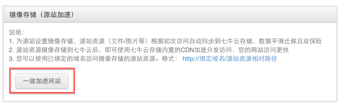
	
然后，再设置源站的域名或者IP，而镜像空间为您当前所操作的空间，不可更改，如下图所示。
	
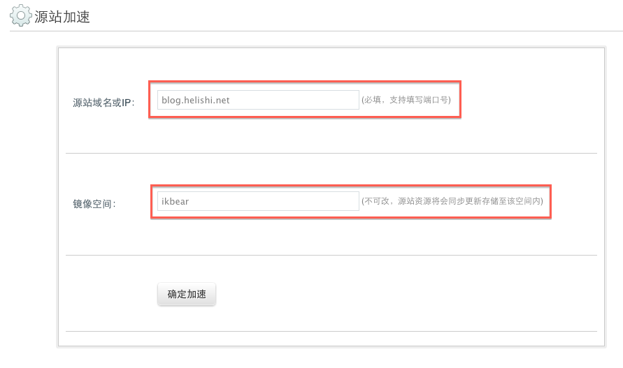
	

#### 3. 如何取消镜像存储？

要取消镜像存储，只需将当前镜像存储的域名删除即可，如下图所示。
	
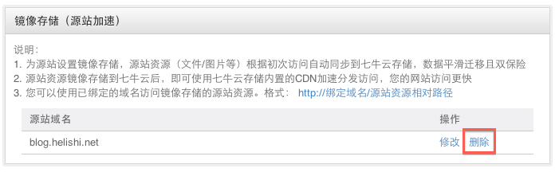

### 发布静态网站 

#### 1. 什么是静态网站？

静态网站是指其内容由静态资源如HTML、JavaScript和CSS等组成的网站，它不涉及动态的从数据库获取数据，一般将数据写入HTML文件直接保存在磁盘里。
	

#### 2. 如何用七牛云存储发布和更新静态网站？

由于七牛云存储可以用于存储任何非结构化的数据，并且只要设置了公开外链，就可以在互联网上访问，因此也可以用七牛云存储来发布和更新静态网站。
	
要使用七牛云存储来发布静态网站，您需要在七牛云存储开发者中心的[“空间管理”](#https://dev.qiniutek.com/buckets)中设置[绑定域名，创建公开外链](#publish-with-custom-domain)，然后使用七牛云存储的[qrsync 命令行辅助同步工具](#http://docs.qiniutek.com/v3/tools/qrsync/)将您的静态网站同步到空间中。这样，您就可以使用绑定的域名访问该静态网站。
	

#### 3. 七牛云存储针对静态资源资源访问是否提供 GZip 压缩输出加速访问？

七牛云存储默认为客户存储的静态资源提供 GZip 压缩输出，以便您的客户加速访问。

#### 4. 如何为静态网站自定义 404 Not Found 页面？
	
为您的静态网站创建公开外链后，您只需上传一个 Key 值为`errno-404`，Value值为自定义的 404 Not Found 内容即可。

#### 5. 如何取消静态网站发布？

[取消公开外链](#file:///Users/helishi/Project/Go/qbox/apidoc/FAQ.md#publish-with-custom-domain)，即可取消静态网站的发布。

### 图像处理 

#### 1. 七牛云存储是否提供自定义缩略图处理？如何使用？
	
可以。
	
设定好缩略图规格之后，你可以在组装的URL中使用不同的缩略图规格来生成不同规格的缩略图。使用示例请看[API文档](#http://docs.qiniutek.com/v3/api/foimg/#fo-imageView)
	

#### 2. 如何自定义缩略图规格？

要使用七牛云存储提供的自定义缩略图，您可以使用我们提供的灵活而强大的[API](#http://docs.qiniutek.com/v3/api/foimg/#fo-imageView)来生成制定规格的缩略图，或者在七牛云存储开发者中心的[“空间管理”](#https://dev.qiniutek.com/buckets)中方便的设置缩略图规格，如以下两图所示。
	
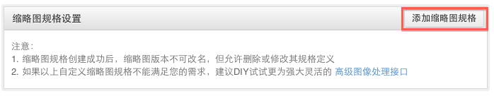
	
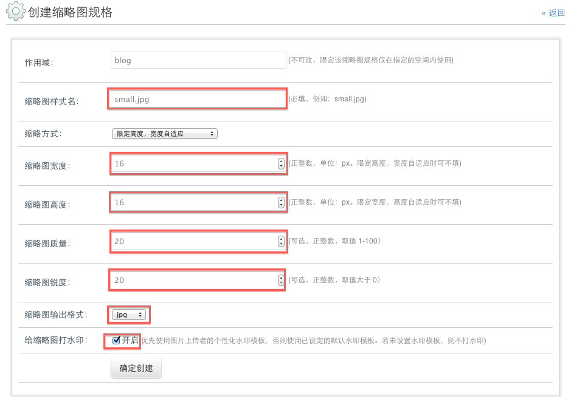
	

#### 3. 如何自定义友好URL风格？
	
七牛云存储资源的访问外链支持设定友好风格的URL。友好风格的URL包括友好风格的[连接符](#http://docs.qiniutek.com/v3/api/io/#pub-separator)和友好风格的[样式名](#http://docs.qiniutek.com/v3/api/io/#pub-style)。
	
友好风格的连接符可以在七牛云存储开发者中心的[“空间管理”](#https://dev.qiniutek.com/buckets)中设置，其中给出了5种常用的分隔符，如感叹号!、地址符（@）、中划线（-）、下划线（_）和斜杠（/），如需使用别的友好风格连接符，可以通过[API](#http://docs.qiniutek.com/v3/api/io/#pub-separator)来实现。
	
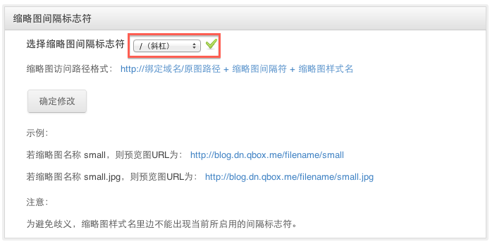
	
友好风格的样式名则必须通过[API](#http://docs.qiniutek.com/v3/api/io/#pub-style)来实现或者[取消](#http://docs.qiniutek.com/v3/api/io/#pub-unstyle)。
	

#### 4. 是否提供打水印的功能？

提供。
	
七牛云存储提供的打水印功能比较灵活，客户可以在图片上打上自定义的默认水印（如公司logo等），也可以为您的用户上传的图片打上针对上传图片用户的个性化水印。详情请参考七牛云存储API文档中的[图像处理接口](#http://docs.qiniutek.com/v3/api/foimg/)

#### 5. 如何设置原图（源文件）保护？

原图（源文件）保护是指将原图（源文件）设为私有，用户只能通过原图（源文件）的另一种方式访问它。例如，将图片打上水印后，您可能希望用户只能访问打水印后的图片，而不希望用户访问原图片，那么就可以使用原图（源文件）保护的功能。
	
要开启原图（源文件）保护功能，只需通过七牛云存储开发者中心后台的[空间管理](#https://dev.qiniutek.com/buckets/)即可开启该功能，如下图所示。
	
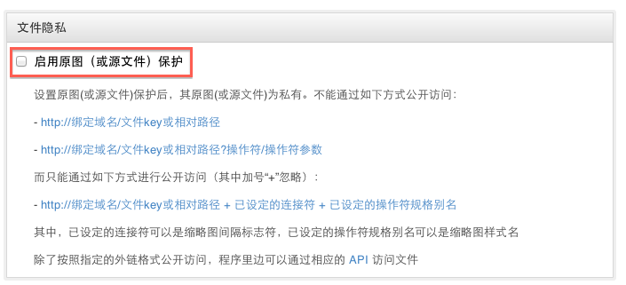
	

### 视频/音频处理 

#### 1. 七牛云存储是否支持为上传的视频/音频源文件提供压缩转码处理？

支持。
	

#### 2. 如何使用七牛云存储的视频/音频处理服务？

七牛云存储的视频/音频处理服务暂时没有对外开放，如需使用请[联系我们](#http://qiniutek.com/about/contact/)。	

## 四、工具篇 

#### 1. 如何使用命令行工具同步文件到七牛云存储？

为了方便广大开发者同步文件，七牛云存储提供了 qrsync 命令行辅助同步工具，您使用该工具即可将本地的某目录的文件同步到七牛云存储中。详细使用方法请参考[相应的文档](#http://docs.qiniutek.com/v3/tools/qrsync/)。
	

#### 2. 有无提供命令行工具辅助开发调试？

七牛云存储为开发者提供了[qboxrsctl 命令行辅助工具](#http://docs.qiniutek.com/v3/tools/qboxrsctl/)。使用该工具，您可以在命令行登入七牛云存储云端，操作您的 Bucket，这些操作所覆盖的功能范围比[七牛云存储开发者中心](#https://dev.qiniutek.com)所覆盖的功能范围更广。

## 五、开发篇

#### 1. 七牛云存储服务集群如何架构？

七牛云存储在全球设有多个节点，您的用户上传文件时，七牛云存储会会他自动选择就近的存储服务器进行存储。用户上传的所有文件，都会在多个IDC机房进行多副本的备份，以保证数据的安全。详情请参考下图架构图。
	
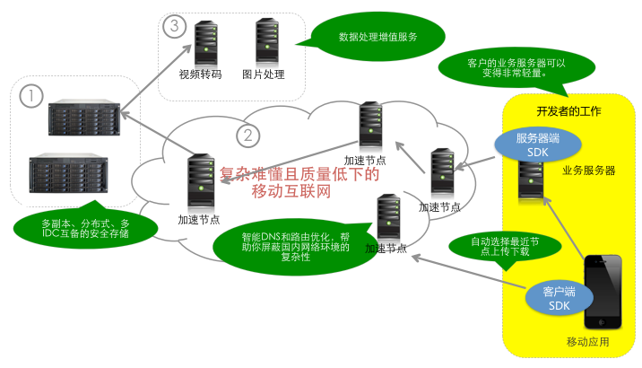

#### 2. Web 网页如何向七牛云存储直传文件？

您可以让您的用户通过表单的形式向七牛云存储服务器直传文件，而无需通过您的服务器中转。为此，您的业务服务器需要做两件事情：一是向您的用户[颁发上传授权](#http://docs.qiniutek.com/v3/api/io/#upload-token)，二是为您需要向七牛的云存储服务器直传文件的客户[提供一个隐藏的表单](#http://docs.qiniutek.com/v3/api/io/#upload-file-by-html-form)，其中包含一些必要的参数会以隐藏的形式发送给七牛云存储服务器。
	
这样，您的客户就可以直接向七牛云存储服务器上传文件了。
	

#### 3. iOS / Android 移动端如何向七牛云存储直传文件？

如果您的用户有使用移动端 App 上传文件（比如照片或视频）的需求，可以把您服务器得到的此 upload_token 返回给手持设备端的 App，然后您的移动 App 可以使用[七牛云存储 Objective-SDK （iOS）](#https://github.com/qiniu/objc-sdk)或[七牛云存储 Android-SDK](#https://github.com/qiniu/android-sdk)的相关上传函数或参照[七牛云存储API之文件上传](#http://docs.qiniutek.com/v3/api/io/#upload)直传文件。

#### 4. PC / 服务端程序如何向七牛云存储直传文件？

要上传一个文件，首先需要获得上传授权，七牛云存储通过 `uploadToken` 的方式实现上传授权操作。`uploadToken` 可以根据 `accessKey` 和 `secretKey` 对一组数据进行数字签名生成。在 PC或者服务器端上传文件，也跟通过 Web 网页端 或者 iOS / Android 移动端向七牛云存储直传文件一样，只需将该 `uploadToken` 作为文件上传流中 `multipart/form-data` 的一部分进行传输，也可以附带在上传请求的 `HTTP Headers` 中传输，即可向七牛云存储直传文件。详情请参考[七牛云存储上传文件API文档](#http://docs.qiniutek.com/v3/api/io/#upload)。
	
